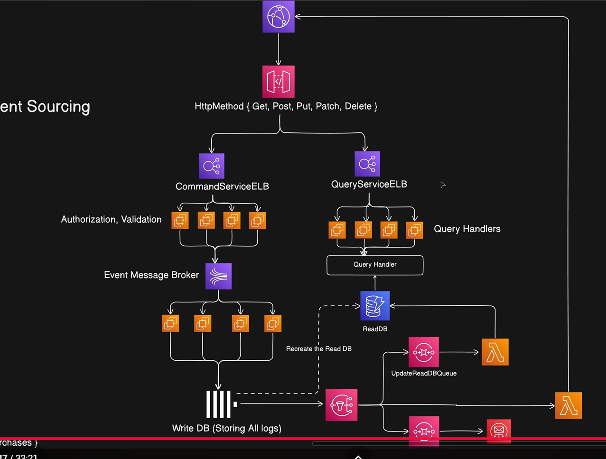

# 📘 System Design – Deep Dive (Beginner → Intermediate)

---

## 🚀 Introduction

System Design is about building systems that can handle massive traffic without crashing.

Examples:
- Amazon during sale
- Instagram reels traffic
- IRCTC tatkal booking

Goal:
- Scalable
- Reliable
- Fast

---

## 🧑‍💻 Basic Concept: Client & Server

### Client
User-side device:
- Browser
- Mobile app
- IoT

👉 Sends requests

---

### Server
A machine that:
- Runs 24/7
- Has public IP
- Processes requests

Examples:
- AWS EC2
- DigitalOcean

---

## 🌐 IP Address

Unique identity of a server on the internet.

Example:
142.251.42.110

---

## 🌍 DNS (Domain Name System)

Maps domain → IP

Example:
amazon.com → IP address

Flow:
1. Enter domain
2. DNS returns IP
3. Request goes to server

---

## ⚠️ Server Overload

Server has limited:
- CPU
- RAM

Too many users → crash

Example:
Exam result websites

---

## 📈 Scaling Techniques

---

### 🔼 Vertical Scaling (Scale Up)

Increase power of single server:
More CPU + More RAM

Pros:
- Simple

Cons:
- Expensive
- Downtime
- Limited

---

### 🔁 Horizontal Scaling (Scale Out)

Add multiple servers:
Server A  
Server B  
Server C  

Pros:
- No downtime
- Highly scalable

Cons:
- Needs load balancing

---

## ⚖️ Load Balancer

Distributes traffic across servers.

### Algorithms:
- Round Robin
- Least Connections
- IP Hash

Extra features:
- Health checks
- Failover
- SSL handling

---

## 🧩 Microservices Architecture

Break system into smaller services:

- Auth
- Orders
- Payment

Pros:
- Independent scaling
- Easier maintenance

Cons:
- More complexity

---

## 🚪 API Gateway

Entry point of system.

Handles:
- Routing
- Authentication
- Rate limiting

Flow:
Client → API Gateway → Service

---

## 🔄 Background Processing

Some tasks take time:
- Emails
- File processing

Use background workers instead of blocking user.

---

## 📬 Queue System (Async)

Tasks go into queue.

Flow:
Payment → Queue → Worker → Email

Benefits:
- Faster response
- Retry support

Tools:
- SQS
- Kafka
- RabbitMQ

---

## 📡 Pub/Sub (Event Driven)

One event → multiple services

Example:
Payment →
- Email
- SMS
- Notification

Difference:

Queue → One consumer  
Pub/Sub → Multiple consumers  

---

## 🧠 Fan-Out Architecture

Combines Pub/Sub + Queue

Flow:
Event → Multiple Queues → Workers

Advantage:
- Reliable + scalable

---

## 🚫 Rate Limiting

Limit requests to prevent abuse.

Example:
100 requests/min per user

Algorithms:
- Token Bucket
- Leaky Bucket

---

## 🗄️ Database Scaling

Single DB becomes bottleneck.

### Solution:

#### Read Replicas
- Reads → replicas
- Writes → primary

#### Sharding (advanced)
- Split data

---

## ⚡ Caching (Redis)

Store frequently used data in memory.

Flow:
Cache → If miss → DB → Save in cache

Benefits:
- Faster response
- Less DB load

---

## 🌍 CDN (Content Delivery Network)

Serve content from nearest location.

Flow:
User → Nearest CDN → Response

Examples:
- Cloudflare
- AWS CloudFront

---

## 🧱 Final Architecture

User
 ↓
DNS
 ↓
CDN
 ↓
Load Balancer
 ↓
API Gateway
 ↓
Microservices
 ↓
Queue / Workers
 ↓
Database + Cache

---

## 💡 Key Takeaways

- Prefer horizontal scaling
- Use async processing
- Cache frequently used data
- Protect with rate limiting
- Use microservices for large systems

---

## 🧠 Practical Advice

Try implementing:
- Redis caching
- Queue (BullMQ / Kafka)
- Load balancing (NGINX)
- Microservices with Docker

---

# 📘 System Design – Crash Course (Part 2)

---

## 🚀 Introduction

This part dives deeper into real-world system design concepts:

- Traffic patterns and scalability
- Serverless architecture (AWS Lambda)
- Virtualization vs Containers
- Kubernetes (container orchestration)

💡 System design is not fixed — it evolves based on use case and traffic.

---

## 🧠 Core Idea: Trade-offs

Every system balances:
- Scalability
- Reliability
- Cost

You cannot maximize all three at once.

---

## 📊 Traffic Patterns (Most Important)

Understanding traffic is key to system design.

---

### 🎥 Netflix (Predictable Traffic)

- Movies release on fixed dates
- Traffic spikes are predictable

Strategy:
- Pre-scale servers
- Cache content in CDN
- Prepare before release

---

### ▶️ YouTube (Unpredictable Traffic)

- Sudden spikes anytime
- Viral content, live streams

Strategy:
- Always keep extra capacity
- Handle unpredictable spikes

---

### 🏏 Hotstar (Mixed Traffic)

- Movies + Live streaming

Behavior:
- Match start → spike
- Player events → spike
- Users go back → spike on home API

Key insight:
Traffic in one service affects another.

---

## ⚡ Traditional Server Problems

- Manual scaling
- OS management
- Infrastructure complexity

---

## ☁️ Serverless (AWS Lambda)

### Idea:
Write code → Cloud handles everything

### How:
- Each request triggers a function
- Auto scaling per request

---

### ✅ Pros:
- No server management
- Auto scaling
- Pay per request

---

### ❌ Cons:

- Cold start latency
- Stateless (no memory)
- Execution time limits
- Vendor lock-in
- Hidden costs (API Gateway, S3, etc.)
- DB connection overload

---

## 🖥️ Virtualization (VMs)

### Idea:
Full virtual machines with OS

Pros:
- Consistent environment

Cons:
- Heavy (GBs)
- Slow
- Expensive

---

## 📦 Containerization (Docker)

### Idea:
Lightweight VMs without OS

- Share host OS
- Only include code + dependencies

---

### Benefits:
- Fast startup
- Lightweight
- Easy scaling
- Consistent environment

---

## ⚠️ New Problem

Many containers → hard to manage

---

## 🧠 Container Orchestration

Automating:
- Deployment
- Scaling
- Management

---

## ☸️ Kubernetes

### Built by Google

Inspired by Borg → open sourced

---

### What it does:

- Auto scaling
- Self-healing
- Rolling updates
- Load balancing

---

### Example:

Old containers replaced gradually → zero downtime

---

## 🧱 Modern Architecture

User  
↓  
CDN  
↓  
Load Balancer  
↓  
API Gateway  
↓  
Containers (Docker)  
↓  
Kubernetes  
↓  
Database  

---

## 🔥 Final Learning

- Traffic pattern defines architecture
- Serverless is simple but limited
- Containers are industry standard
- Kubernetes manages everything

---

## 🧠 Real World Practice

- Load testing before events
- Simulating traffic spikes
- Monitoring system limits

---

# 📘 System Design – Event Sourcing (Detailed Guide)

---

## 🚀 Introduction

Event Sourcing is a powerful system design pattern where **every change is stored as an event instead of updating the current state directly**.

👉 Instead of storing:
- Current state (like balance = 500)

We store:
- All events (deposit, withdraw, etc.)

---

## 🧠 What is an Event?

An event = something that happened in the system.

Examples:
- User added item to cart
- User placed order
- Video uploaded
- Payment completed

---

## ❌ Problem with Traditional CRUD

In normal systems:
- We directly update DB rows

Problems:
1. Race conditions
2. DB locks → bottleneck
3. No history
4. Hard debugging
5. State inconsistency

---

## 🎥 Real Example: Video Processing

Flow:
1. Upload video → DB status = uploaded
2. Worker picks → status = processing
3. Done → status = success

❌ Problem:
If DB update fails → wrong state forever

---

## ⚡ Event Sourcing Approach

Instead of updating DB:

We store events like:

- VideoUploaded
- VideoProcessingStarted
- VideoProcessed

These are stored in **append-only logs**

---

## 📜 Event Log

- Immutable (never change)
- Append-only
- Ordered

Example:
[VideoUploaded]  
[ProcessingStarted]  
[ProcessingCompleted]  

---

## 🔄 Hydration (Rebuilding State)

To get current state:
- Replay all events

Example:
Uploaded → Processing → Success

Final state = Success

---

## 💰 Banking Example

Instead of:
balance = 500

We store:
- +200
- +300
- -500

Replay:
500 + 200 + 300 - 500 = 500

---

## 🔁 Replay (Superpower)

You can:
- Debug issues
- Audit history
- Time travel (state at past time)

---

## ⚡ Performance Problem

Reading all events every time is slow

Solution:
👉 Maintain a **read model (cache DB)**

- Events → update cache
- Reads → from cache

---

## 🧠 Key Architecture

Write Path:
User → Event → Event Store

Read Path:
Event Store → Cache DB → User

---

## ⚠️ Ordering Problem

Multiple workers can break order

Solution:
👉 Partitioning (Kafka)

Each entity → fixed partition

---

## 🔥 Kafka Concepts

- Topic → stream
- Partition → ordered subset
- Consumer group → workers

Guarantee:
Same entity → same partition → order maintained

---

## 🧱 CQRS (Important)

Command = write  
Query = read  

We separate both:
- Write → events
- Read → cache DB

---

## ✅ Advantages

- Full audit trail
- Easy debugging
- Time travel
- High scalability
- Event-driven systems

---

## ❌ Disadvantages

- Complex to implement
- Hard to migrate later
- Event versioning needed
- Storage grows over time

---

## 🏢 Real World Usage

Used by:
- Uber
- Netflix
- Amazon

---

## 💡 Final Insight

👉 State is temporary  
👉 Events are permanent  

Event Sourcing = thinking in history, not current value

---

## 🔥 Learning Tip

Think like this:

Instead of:
“what is the current state?”

Think:
“how did we reach here?”


# CQRS (Command Query Responsibility Segregation) — Video Summary

> **Video:** CQRS System Design Pattern  
> **Language:** Hindi  
> **Level:** Beginner-Friendly

---

## Table of Contents

1. [The Problem with Traditional Applications](#the-problem-with-traditional-applications)
2. [What is CQRS?](#what-is-cqrs)
3. [How CQRS Works](#how-cqrs-works)
4. [Separate Databases for Each Side](#separate-databases-for-each-side)
5. [Integration with Event Sourcing](#integration-with-event-sourcing)
6. [AWS Architecture Example](#aws-architecture-example)
7. [Key Takeaways](#key-takeaways)
8. [When to Use CQRS](#when-to-use-cqrs)
9. [Notable Quote](#notable-quote)

---

## The Problem with Traditional Applications

In conventional applications, a single database handles all **CRUD operations**:

| Operation | HTTP Method |
|-----------|-------------|
| Create    | POST        |
| Read      | GET         |
| Update    | PUT / PATCH |
| Delete    | DELETE      |

At scale, this becomes a **bottleneck**. For example, when many users are reading a product's price simultaneously while a seller tries to update it, the update acquires a **transaction-level lock** — slowing down all read queries.

> **Real-world analogy:** On Amazon, thousands of users may be reading an earphone's price ($50) at the same moment a seller pushes an update to $30. The write lock acquired during the update blocks all concurrent reads, degrading performance at scale.

**Scaling options in traditional apps:**

- **Vertical Scaling** — Add more CPU/RAM to the same server
- **Horizontal Scaling** — Clone the server and add more instances behind a load balancer

Neither solves the core issue: **reads and writes contend on the same database**.

---

## What is CQRS?

**CQRS = Command Query Responsibility Segregation**

CQRS splits the application into two distinct sides:

| Side        | Responsibility                        | Operations          |
|-------------|---------------------------------------|---------------------|
| **Command** | Mutates data (write side)             | Create, Update, Delete |
| **Query**   | Reads data only (read side)           | Read only           |

> Defined by AWS: *"The CQRS pattern separates data mutation (the Command part) from the Query part of the system."*

---

## How CQRS Works

```
User Request
     │
     ▼
API Gateway
     │
     ├── GET request  ──────────► Query Service  ──► Read DB
     │
     └── POST/PUT/PATCH/DELETE ─► Command Service ──► Write DB
```

An **API Gateway** routes traffic based on HTTP method:
- `GET` → **Query Service** (read path)
- `POST`, `PUT`, `PATCH`, `DELETE` → **Command Service** (write path)

### Command Side Flow

Instead of directly mutating the database, every action generates a **Command object**:

```
ProductUpdateCommand { id: "123", payload: { price: 40 } }
ProductCreateCommand { name: "Earphones", price: 50 }
```

A **Command Handler / Write Model** receives these commands, validates them (e.g., price cannot be negative), checks authorization, and executes the mutation on the Write DB.

### Query Side Flow

- A **Query Handler** receives all read requests
- A **Read Model** is optimized purely for reading
- Data is fetched from the dedicated **Read DB**

---

## Separate Databases for Each Side

CQRS recommends using **different databases** optimized for their respective workloads:

| Side     | Database Type     | Data Format       | Example        |
|----------|-------------------|-------------------|----------------|
| Write DB | SQL (Relational)  | Normalized        | PostgreSQL     |
| Read DB  | NoSQL             | Denormalized JSON | MongoDB        |

### Why Denormalize the Read DB?

In a normalized SQL database, reading a product's full details requires expensive `JOIN` operations across multiple tables (products, orders, inventory, etc.).

In a denormalized Read DB, all related data is pre-joined and stored as a **nested JSON document**. A single query with a `WHERE id = X` returns everything — no joins needed.

### Keeping Databases in Sync

The two databases stay in sync via an **event/message queue**:

```
Write DB ──► Event Emitted ──► Message Queue (Kafka/Kinesis) ──► Read DB Updated
```

This introduces **Eventual Consistency** — a deliberate trade-off:

> A small delay (1–2 seconds) is acceptable compared to the risk of database crashes under heavy load.

**The trade-off:**

| Option | Outcome |
|--------|---------|
| Single DB, fully consistent | Bottleneck → possible downtime at scale |
| Separate DBs, eventual consistency | Scalable, fault-tolerant, slight delay in sync |

---

## Integration with Event Sourcing

CQRS pairs naturally with **Event Sourcing**.

Instead of storing the *final state* in the Write DB, you store an **append-only log** of every event:

```
[ProductCreated]  { id: 1, price: 50, timestamp: T1 }
[PriceUpdated]    { id: 1, price: 40, timestamp: T2 }
[ProductDeleted]  { id: 1,            timestamp: T3 }
```

The Read DB is then a **materialized view** derived by replaying these events (hydration).

### Benefits of Event Sourcing inside CQRS

- Full **audit trail** of every change
- Read DB can be **regenerated** from event logs if corrupted or stale
- Easy **database migration** — just replay events into the new DB
- Enables **fan-out actions** — e.g., a price drop event can simultaneously:
  - Update the Read DB
  - Trigger a promotional email to interested users
  - Invalidate CDN cache

---

## AWS Architecture Example

```
User
 │
 ▼
API Gateway (routes by HTTP method)
 │                        │
 ▼                        ▼
Command ELB           Query ELB
 │                        │
 ▼                        ▼
EC2 Handlers          EC2 Query Handlers
(auth + validation)       │
 │                        ▼
 ▼                    DynamoDB (Read DB)
Kinesis Streams           ▲  ▲
(Kafka equivalent)        │  │
 │                    Lambda (Update Read DB)
 ▼                        │
ClickHouse DB             │
(Append-only Write DB)    │
 │                        │
 ▼                        │
SNS (fan-out)─────────────┘
 │
 ├──► SQS: Update Read DB Queue ──► Lambda ──► DynamoDB
 │
 └──► SQS: Email Queue ──► AWS SES (Simple Email Service)

Optional: CloudFront (CDN) for caching GET responses + cache invalidation Lambda
```

**Component Summary:**

| Component         | Purpose                                          |
|-------------------|--------------------------------------------------|
| API Gateway       | Routes requests by HTTP method                   |
| ELB               | Load balances across EC2 instances               |
| EC2 Handlers      | Authorization, validation, command generation    |
| Kinesis Streams   | Append-only event log (Kafka on AWS)             |
| ClickHouse DB     | Write DB — stores all event logs                 |
| SNS               | Fan-out notifications                            |
| SQS               | Decoupled queues for each downstream action      |
| Lambda            | Serverless processors (update Read DB, email)    |
| DynamoDB          | Read DB — denormalized, fast reads               |
| CloudFront        | CDN caching + cache invalidation                 |

---

## Key Takeaways

- CQRS is **only for complex, high-scale systems** — overkill for basic applications
- The core idea: reads and writes have **different scaling requirements**, so separate them
- **Eventual consistency** is the primary trade-off — not suitable for real-time systems like stock markets
- Event Sourcing fits **naturally** inside CQRS — commands become append-only logs, and the Read DB is a derived materialized view
- The Read DB can always be **regenerated from the event log** if corrupted or stale
- You have the **flexibility to choose different database technologies** for reads vs. writes

---

## When to Use CQRS

Use CQRS when:

- You implement a **database-per-service** pattern and need to join data across multiple microservices
- Your **read and write workloads have separate scaling requirements**
- **Eventual consistency is acceptable** (not for stock markets, financial transactions requiring strong consistency)
- You have **high read-to-write ratios** or vice versa and want to scale each independently

Do **not** use CQRS for:

- Simple CRUD applications
- Small-scale systems
- Systems requiring **strong, real-time consistency**

---

## Notable Quote

> *"If your Read DB ever gets corrupted or stale, you can always regenerate it from the Write DB's event logs — that's the power of combining CQRS with Event Sourcing."*

---

*Summary based on a Hindi tutorial video on CQRS System Design Pattern.*

